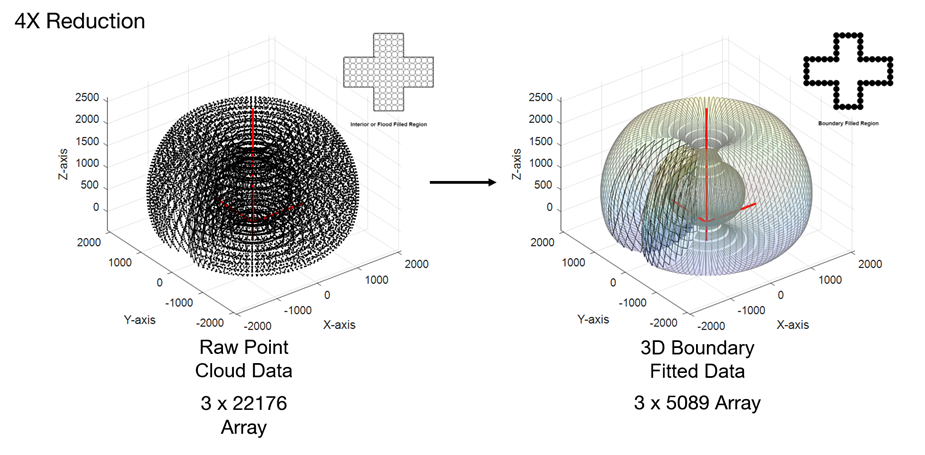

# HarryCncBot
CNC Robot Arm
# Robotics Arm Project

Robotics Arm Project

ได้ออกแบบหุ่นยนต์แขนกล 6 Degree of Freedom จากสมการ Kinematics และ Dynamics โดยจะนำไปทำเป็นหุ่นยนต์วาดรูปได้ตามต้องการ (Drawing Robot) และ ยังเป็นส่วนหนึ่งของคลิป SuperAI2-2811 “[ทำยังไงถึงจะรอดใน Squid Game? (ด้วยหุ่นยนต์ และ AI)](https://www.youtube.com/watch?v=rd8h8sUJEe8&t=7s)” สามารถดู Code ได้ที่ GITHUB [https://github.com/huak95/HarryCncBot.git](https://github.com/huak95/HarryCncBot.git)

# Point Cloud Reconstruction

เป็นการนำ Point Cloud Data [X, Y, Z] ที่มีขนาดใหญ่มาหา 3D Boundary Fitted Data เพื่อทำให้ข้อมูลมีขนาดเล็กลง Processing ต่อได้ง่าย และ สามารถ Visualized ได้ โดยสามารถลดจำนวนข้อมูลลงได้ 4 เท่า

# Trajectory Generation

เป็นการสร้าง Path การเคลื่อนที่ของหุ่นยนต์

# Program Workflow

เป็นการทำงานคร่าวๆ ของโปรแกรม Robot CNC

# Control Theory Simulation

เป็นการ Implement Robot เข้ากับโลกจริง เพราะหุ่นยนต์ของจริงมี Disturbant มากมายทั้ง Gravity, Inertia, Friction, Damp, Stiffness ที่ต้องทำการ Control โดยภาพด้านล่างเป็น Control Loop สำหรับ 1 Joint ของหุ่นยนต์เท่านั้น ส่วนสมการด้านล่างจะเป็น Dynamics Equation ของ 2 Link Arm

โดยสามารถนำสมการข้างต้นมาทำการ Track การเคลื่อนที่ได้อย่างแม่นยำดังภาพ

